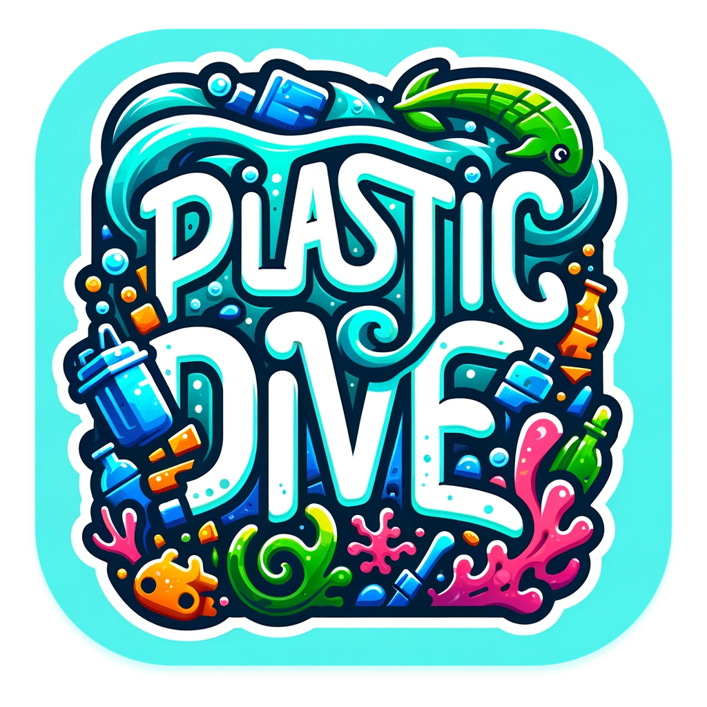

# 🤿 Plastic Dive

I am proud to present my very first game 🙌

I hope you enjoy it!

### 🎮 [Play the game (Web)](https://plastic-dive.web.app/)

## 🐡 Description

### 🎯 Objectives

Plastic Dive is a small game where you play the role of a diver who has to collect plastic waste in the ocean. Each garbage collected will give you points and those can be used to upgrade your diver to dive and swim deeper, faster, longer or to improve your garbage collection speed. But make sure to be back at the surface before your oxygen tank is empty or you will lose the game and all the points you have collected. Be the best diver and reach the top of the leaderboard 🏆

The game is also educational and will teach you about the plastic pollution and the animals living in the ocean. 

You can play it either with the keyboard arrows or a joystick.

## 🤿 Features

- [x] Game is fully functional and has been tested on multiple devices
- [x] Each garbage gives you points and requires a different time to collect, right choices to be made!
- [x] Diver has an oxygen tank that empties over time, to win the game and earn the points, the diver must be back at the surface before the oxygen tank is empty
- [x] Diver can be upgraded with the points earned during the game to increase dive depth (unlock animals), swimming speed, garbage collection speed and oxygen tank capacity
- [x] Tutorial to explain how to play the game on the first launch (+ available from main menu)
- [x] Infocean screen with information about the plastic pollution and the animals
- [x] Leaderboard with the best scores
- [x] Music, sounds and effects during the game (with the possibility to mute them)
- [x] Compatible with Web, MacOS, Windows and Linux
- [x] Screens and game are responsive to any screen size

## 🕹️ How to play the game?

💻 On computer, you can also use the keyboard arrows to move the diver and the space bar to collect the garbage.

The game is over when the oxygen tank is empty, so make sure to be back at the surface before it is too late!

## ▶️ How to run the app?

- Clone the repository
- Run `flutter pub get`
- Run `flutter run`
- Enjoy the game!

## 🛠️ Technologies

- Cross-Platform App Framework: [Flutter](https://flutter.dev/)
- Game Engine: [Flame](https://flame-engine.org/)
- Architecture Framework: [Stacked](https://pub.dev/packages/stacked)
- Leaderboard Storage: [Cloud Firestore](https://firebase.google.com/docs/firestore)

### Other packages

- [shared_preferences](https://pub.dev/packages/shared_preferences)
- [flame_audio](https://pub.dev/packages/flame_audio)
- [animations](https://pub.dev/packages/animations)
- [introduction_screen](https://pub.dev/packages/introduction_screen)
- [meta_seo](https://pub.dev/packages/meta_seo)

## 🔮 Future evolutions

- [ ] Multi-platform performance
- [ ] Add more animals and garbage
- [ ] Publish the game on stores
- [ ] Add more educational content about the plastic pollution and the animals
- [ ] Add haptic feedback
- [ ] Add the possibility to share the game
- [ ] Add the possibility to rate the game
- [ ] Add the possibility to report a bug
- [ ] Add the possibility to contact the support
- [ ] Add the possibility to change the language
- [ ] Do a daily / weekly / all the time leaderboard
- [ ] Add a in-game tutorial to explain how to play the game instead of a separate screen
- [ ] Add a news screen to display the latest news about the plastic pollution

